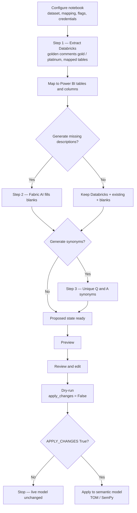

# Databricks ↔ Power BI (Fabric) metadata sync

This guide is for **Power BI developers** who run the notebook and for **report owners** who care what ends up on the model. It describes the live developer path in `template/Dataset_Metadata_Sync.ipynb`. The engine lives in `utilities/UtilitiesV2.py` (`MetadataSyncEngine`). `utilities/Applier.py` is a compact script of the same pipeline; use the notebook.

Nothing is written to the live semantic model until `engine.apply(apply_changes=True)`.

---

## Contents

**Overview**
- [What this is (business)](#what-this-is-business)
- [Who runs it](#who-runs-it)

**Configuration**
- [Configuration](#configuration)
  - [Dataset and workspace](#dataset-and-workspace)
  - [TABLE_MAPPING](#table_mapping)
  - [COLUMN_NAME_MAP (optional)](#column_name_map-optional)
  - [Credentials — never paste tokens](#credentials--never-paste-tokens)
  - [Description and synonym switches](#description-and-synonym-switches)
  - [Overwrite existing descriptions with AI (`regenerate_*`)](#overwrite-existing-descriptions-with-ai-regenerate_)
  - [PREVIEW_OBJECT_TYPES](#preview_object_types)

**Process and pipeline**
- [Process flow](#process-flow)
- [Pipeline steps (matches the notebook log)](#pipeline-steps-matches-the-notebook-log)
  - [Step 1 — Databricks](#step-1--databricks)
  - [Step 2 — Descriptions](#step-2--descriptions)
  - [Step 3 — Synonyms](#step-3--synonyms)
  - [Proposed state ready](#proposed-state-ready)

**Preview, review, and apply**
- [Preview `Source` column](#preview-source-column)
- [Review and edit](#review-and-edit)
  - [Preview](#preview)
  - [`update_proposed_metadata`](#update_proposed_metadata)
  - [Filter cell (notebook section 6)](#filter-cell-notebook-section-6)
  - [Clear: session vs live model](#clear-session-vs-live-model)
- [Overwrite existing descriptions](#overwrite-existing-descriptions)
- [Dry-run vs apply](#dry-run-vs-apply)
- [What developers will see in the log](#what-developers-will-see-in-the-log)
- [Typical developer sequence](#typical-developer-sequence)

**FAQ**
- [FAQ](#faq)
  - [Does this generate descriptions and synonyms for unmapped tables, columns, and measures?](#does-this-generate-descriptions-and-synonyms-for-unmapped-tables-columns-and-measures)
  - [How is a table description generated?](#how-is-a-table-description-generated)
  - [How are column descriptions generated?](#how-are-column-descriptions-generated)
  - [How are measure descriptions generated?](#how-are-measure-descriptions-generated)
  - [How do I overwrite descriptions or synonyms already on the model?](#how-do-i-overwrite-descriptions-or-synonyms-already-on-the-model)
  - [How do I replace AI wording before it is applied to the model?](#how-do-i-replace-ai-wording-before-it-is-applied-to-the-model)
  - [Can I clear descriptions or synonyms on certain objects?](#can-i-clear-descriptions-or-synonyms-on-certain-objects)
  - [Can I clear descriptions or synonyms for all columns, or for more than one table?](#can-i-clear-descriptions-or-synonyms-for-all-columns-or-for-more-than-one-table)
  - [Does apply write the model if I only ran `clear_metadata`?](#does-apply-write-the-model-if-i-only-ran-clear_metadata)
  - [What is the difference between dry-run and apply?](#what-is-the-difference-between-dry-run-and-apply)
  - [Are Q&A synonyms unique if two objects want the same phrase?](#are-qa-synonyms-unique-if-two-objects-want-the-same-phrase)
  - [What if I see a Spark SQL warning, then a warehouse query?](#what-if-i-see-a-spark-sql-warning-then-a-warehouse-query)
  - [How do I preview only columns (or one object type)?](#how-do-i-preview-only-columns-or-one-object-type)
  - [What if a Databricks comment and an existing model description both exist?](#what-if-a-databricks-comment-and-an-existing-model-description-both-exist)
  - [What if Databricks credentials are missing?](#what-if-databricks-credentials-are-missing)

**Optional (off by default)**
- [AI instructions](#ai-instructions-optional-default-off)

**Reference**
- [Glossary](#glossary)
- [Author and contact](#author-and-contact)

---

## What this is (business)

The sync copies **Unity Catalog comments** (table and column notes written in Azure Databricks) into a **Fabric semantic model** (the dataset behind Power BI reports). Where Databricks has no comment, **Fabric AI** can write a short business description. It can also add **Q&A synonyms** — extra phrases people might type in Power BI Q&A — and keeps those phrases unique across the whole model so two objects never share the same synonym.

Developers review a **proposed** table first (preview, edit, dry-run). The published model does not change until someone explicitly applies.

| What you get | Who benefits |
| --- | --- |
| Databricks comments on mapped tables and columns | Report authors see the same wording data engineers already wrote |
| AI descriptions only where text is still blank (unless you turn overwrite on) | Measures, calculated columns, and unmapped tables still get documentation |
| Unique Q&A synonyms | Users can ask questions without guessing the exact field name |
| Review → dry-run → apply | Business owners can approve wording before it goes live |

---

## Who runs it

1. Open `template/Dataset_Metadata_Sync.ipynb` in a **Fabric workspace that can see the semantic model**.
2. Run the first code cell: `%run UtilitiesV2` (loads `UtilitiesV2.py` into the session).
3. Confirm dataset, workspace, and mapping cells.
4. Run **Build** and **Preview**, then filter or edit if needed.
5. Run **Dry-run**. Run **Apply** only when you intend to write the model.

You need permission to read Databricks (warehouse + token or Key Vault) and to open the semantic model in Fabric. Report owners typically review the preview table; they do not need to run the notebook.

---

## Configuration

Set these in the notebook before `init_metadata_sync(...)`.

### Dataset and workspace

```python
DATASET_NAME = "Global Revenue Analytics_Dataset_Descriptions_Synonyms"
WORKSPACE_NAME = "DEV IT Finance Datasets"
SYNONYM_CULTURE = "en-US"
```

`DATASET_NAME` is the semantic model. `WORKSPACE_NAME` is the Fabric workspace that holds it. `SYNONYM_CULTURE` is the linguistic culture for Q&A synonyms (default `en-US`).

### TABLE_MAPPING

**Power BI table → Databricks table(s).** Use a string, or a list when one Power BI table is sourced from more than one Unity Catalog object.

```python
TABLE_MAPPING = {
    "fact_onhanddetails": "fact_onhand_global_inv_plt",
    "dim_item": "dim_item",
    "dim_itemlookup": "dim_item",   # one Databricks table can feed several Power BI tables
    # "some_pbi_table": ["dbr_view_a", "dbr_view_b"],
}
```

The notebook sets `auto_discover_tables="no"`, so only tables you list are mapped. Re-run **Build** after you change the mapping.

### COLUMN_NAME_MAP (optional)

Used when the Databricks column name and the Power BI column name differ. Keyed by **Databricks** table name:

```python
COLUMN_NAME_MAP = {
    "fact_onhand_global_inv_plt": {
        "InventoryItem_ID": "INVENTORY_ITEM_ID",  # Databricks → Power BI
        "Organization_ID": "Organization_ID",
    },
}
```

Unlisted columns still match when names are the same ignoring case and punctuation.

### Credentials — never paste tokens

`load_databricks_credentials(...)` reads secrets in this order:

1. Environment variables
2. A Fabric Key Vault, if you name one

| What | Environment variable | Key Vault secret (defaults) |
| --- | --- | --- |
| Warehouse host | `DATABRICKS_SERVER_HOSTNAME` or `DATABRICKS_HOST` | `databricks-server-hostname` |
| HTTP path | `DATABRICKS_HTTP_PATH` | `databricks-http-path` |
| Token | `DATABRICKS_ACCESS_TOKEN` or `DATABRICKS_TOKEN` | `databricks-access-token` |
| Vault name | `FABRIC_KEY_VAULT_NAME` or `KEY_VAULT_NAME` | — |

```python
KEY_VAULT_NAME = None  # e.g. "kv-hda-mde-dev"
DATABRICKS_SERVER_HOSTNAME, DATABRICKS_HTTP_PATH, DATABRICKS_ACCESS_TOKEN = load_databricks_credentials(
    key_vault_name=KEY_VAULT_NAME
)
```

Do not paste tokens into the notebook. If credentials are missing, Step 1 is skipped and descriptions come from the model and Fabric AI only.

### Description and synonym switches

These go into `init_metadata_sync(...)`. Databricks Unity Catalog comments **always** apply when they exist. Description flags only control Fabric AI fill-in for objects Step 1 did not describe. Synonym flags are independent: you can generate descriptions without synonyms, or vice versa.

| Switch | Default | What it does |
| --- | --- | --- |
| `GENERATE_MISSING_TABLE_DESCRIPTIONS` | `True` | AI for mapped tables with no UC table comment, plus model-only tables |
| `GENERATE_MISSING_COLUMN_DESCRIPTIONS` | `True` | AI for calculated columns and unmapped / source columns |
| `GENERATE_MISSING_MEASURE_DESCRIPTIONS` | `True` | AI for measures with a blank description |
| `GENERATE_TABLE_SYNONYMS` | `True` | 3–5 unique synonyms per table |
| `GENERATE_COLUMN_SYNONYMS` | `True` | 5–10 per column (calculated, unmapped/source, and Databricks-mapped) |
| `GENERATE_MEASURE_SYNONYMS` | `True` | At least 10 per measure |

Set a flag `False` to skip that AI batch. The log then prints a skip line (counts only, no object-name dump).

### Overwrite existing descriptions with AI (`regenerate_*`)

Default is **off**. Pass these into `init_metadata_sync(...)` (they flow through to `build_documentation_plan`):

```python
engine = init_metadata_sync(
    ...,
    regenerate_table_descriptions="no",    # "yes" = AI overwrites existing table descriptions
    regenerate_column_descriptions="no",
    regenerate_measure_descriptions="no",
)
```

Databricks-mapped columns that already have a Unity Catalog comment are **not** sent to Fabric AI, even when regenerate is on. The warehouse comment stays the source of truth.

### PREVIEW_OBJECT_TYPES

After build, choose what the preview table shows:

```python
PREVIEW_OBJECT_TYPES = ["tables", "columns", "measures"]  # or a subset
preview_df = engine.preview(object_types=PREVIEW_OBJECT_TYPES)
```

Allowed values: `"tables"`, `"columns"`, `"measures"` (aliases: `table`, `column`, `measure`).

---

## Process flow



See [FAQ](#faq) for overwrite, clear, prompts, uniqueness, and credentials.

---

## Pipeline steps (matches the notebook log)

Run `engine.build()` after configuration. This does **not** write the semantic model. Re-run Build only when mappings or generation switches change.

### Step 1 — Databricks

Step 1 reads approved comments from `main.governance.metadata_comments_golden` (view-name union source-table rows) for schemas **`gold`** and **`platinum`**, filtered to the Databricks table names in `TABLE_MAPPING`.

Then it maps those comments onto Power BI tables and columns using `TABLE_MAPPING` and `COLUMN_NAME_MAP`.

Typical log lines (counts, not names):

```text
=== Metadata sync: build ===
Step 1 — Databricks: extracted 184 column comments from 22 Unity Catalog tables.
Step 1 — Mapping: 21 Power BI tables mapped; 184 columns already described from Databricks.
```

If credentials are missing:

```text
Step 1 — Databricks: skipped (credentials not configured). Descriptions will come from the model and Fabric AI only.
```

If extract fails, the run continues without Unity Catalog comments.

### Step 2 — Descriptions

**Databricks comments first.** Fabric AI runs only for objects that are still blank, unless a `regenerate_*_descriptions` flag is on.

```text
Step 2 — Descriptions: generating AI text for objects with no Databricks comment.
Step 2 — Descriptions: tables — 12 from Databricks, 3 generated (mapped), 4 already in the model, 2 generated (model-only).
Step 2 — Descriptions: skipped measures (generate_missing_measure_descriptions=False).
----- Fabric AI: table descriptions (3 mapped tables) -----
```

AI banners look like `----- Fabric AI: <what is running> -----` just above Fabric’s progress bar. If Fabric AI is unavailable, mapping, preview, edit, and dry-run still work; those objects stay blank (`Missing`).

### Step 3 — Synonyms

Collision-free across the whole model (a shared registry is seeded from synonyms already on the model).

| Object | How many |
| --- | --- |
| Tables | 3–5 |
| Columns | 5–10 |
| Measures | at least 10 |

```text
Step 3 — Synonyms: generating unique business synonyms (collision-free across the model).
Step 3 — Synonyms: tables — 21 generated (3–5 each).
Step 3 — Synonyms: skipped measures (generate_measure_synonyms=False).
```

### Proposed state ready

Build finishes in memory:

```text
=== Proposed metadata ready: 412 objects ===
  Source: Databricks 184 | AI 90 | Existing 120 | Missing 18
```

Then: **preview → edit → dry-run → apply**.

---

## Preview `Source` column

Preview columns: `Object Type`, `Table Name`, `Object Name`, `Source (Databricks vs AI)`, `Original Description`, `Proposed Description`, `Synonym Existed`, `Existing Synonyms`, `Proposed Synonyms`. `Synonym Existed` is Yes/No from the live-model synonym snapshot at last `build()` (same as `Existing Synonyms`); `Proposed Synonyms` is this run.

| Source | Meaning |
| --- | --- |
| **Databricks** | Unity Catalog comment brought in this build. |
| **AI** | Fabric generated or regenerated this text this build. |
| **Existing** | The model already has text; it is **not** overwritten by default. |
| **Missing** | Blank on the model and not generated this build (flag off, AI unavailable, or nothing to say). |
| **Manual** | You edited proposed wording in this session. |
| **Cleared** | You cleared proposed descriptions **and** synonyms; no rebuild yet. |
| **Cleared for description** | You cleared proposed descriptions only; **Proposed Synonyms are unchanged**. |
| **Cleared for synonyms** | You cleared proposed synonyms only; descriptions are unchanged. |

`Source`, `Original Description`, `Synonym Existed`, and `Existing Synonyms` are display-only. They are ignored when you call `update_proposed_metadata`.

---

## Review and edit

These helpers change **proposed** (session) state only.

### Preview

```python
preview_df = engine.preview(object_types=["tables", "columns", "measures"])
display(preview_df)
```

### `update_proposed_metadata`

One object, a list of dicts, a DataFrame, or a single preview-column dict. Mix tables, columns, and measures. Omit `new_desc` or `new_synonyms` to leave that field unchanged. After a successful edit, Source becomes **Manual**. Pass `table_name` when the object name is not unique.

```python
# One object
update_proposed_metadata(
    object_name="DIOH Card",
    new_desc="Average number of days of inventory on hand.",
    new_synonyms=["days of inventory", "inventory days", "stock coverage days"],
    table_name="_Measure",
    object_type="measure",
)

# List of dicts
update_proposed_metadata(updates=[
    {
        "object_name": "DIOH Card",
        "table_name": "_Measure",
        "object_type": "measure",
        "new_desc": "Average number of days of inventory on hand.",
        "new_synonyms": ["days of inventory", "inventory days", "stock coverage days"],
    },
])

# Preview-column dict (Source / Original Description ignored)
update_proposed_metadata(updates={
    "Object Type": "Measure",
    "Table Name": "__Measures",
    "Object Name": "ASP Prior PTD",
    "Proposed Description": "Prior period-to-date average selling price per unit.",
    "Proposed Synonyms": "prior period to date average price, average unit price prior period to date",
})

# DataFrame of preview rows
update_proposed_metadata(updates=filtered_df)
```

### Filter cell (notebook section 6)

Set filters, then run the cell. Filters are case-insensitive. Leave a filter `None` / empty to skip it. `MATCH_MODE` applies only to table and object name.

```python
FILTER_OBJECT_TYPES = ["columns"]   # or "tables", "measures", or a mix
FILTER_TABLE_NAME = None            # e.g. "fact_onhanddetails"
FILTER_OBJECT_NAME = None
FILTER_SOURCE = None                # "AI", "Databricks", "Existing", "Missing", "Manual"
MATCH_MODE = "exact"                # or "contains"

filtered_df = filter_preview_for_update(
    preview_df,
    object_types=FILTER_OBJECT_TYPES,
    table_name=FILTER_TABLE_NAME,
    object_name=FILTER_OBJECT_NAME,
    source=FILTER_SOURCE,
    match_mode=MATCH_MODE,
)
```

- **Path A — many objects.** Copy filtered rows into `updates_df` (or build an `UPDATES` list), edit Proposed Description / Proposed Synonyms, delete rows you do not want. Leave `APPLY_FILTERED_UPDATES = False` to print copy-paste `update_proposed_metadata(...)` calls. Set it `True` to write those edits into the **session** proposed state (not the live model).
- **Path B — one object.** Uncomment the single-object kwargs call, or pass one preview-column dict.

### Clear: session vs live model

| Function | What it touches |
| --- | --- |
| `clear_metadata(scope=..., target_name=..., clear_descriptions=..., clear_synonyms=...)` | **Session only.** By default resets proposed text to the original model description (or blank) **and** proposed synonyms to `[]`. Source becomes `Cleared`. Pass `clear_synonyms=False` to blank descriptions only; Proposed Synonyms stay as they are (Source `Cleared for description`). Write-through does not set `Replace Synonyms` or empty synonym lists. Pass `clear_descriptions=False` and `clear_synonyms=True` to empty Proposed Synonyms only (Source `Cleared for synonyms`); descriptions stay as they are and write-through sets `Replace Synonyms` so apply can remove live Q&A synonyms without blanking `Desc`. |
| `clear_semantic_model_metadata(...)` | **Live model.** Wipes descriptions and/or synonyms on the semantic model. Defaults to dry-run (`dry_run="yes"`). All `clear_*` switches default to `"no"`, including `clear_column_descriptions` and `clear_column_synonyms`. |

```python
clear_metadata(scope="measures", target_name="DIOH Card")
clear_metadata(scope="columns")
clear_metadata(scope="tables")
clear_metadata(scope="all")

# Column descriptions on one table (or a list); proposed synonyms left unchanged.
clear_metadata(
    scope="columns",
    target_name="fact_onhanddetails",          # or ["fact_a", "fact_b"]
    clear_descriptions=True,
    clear_synonyms=False,
)

# Column synonyms on one table (or a list); descriptions / comments left unchanged.
clear_metadata(
    scope="columns",
    target_name="fact_onhanddetails",          # or ["fact_a", "fact_b"]
    clear_descriptions=False,
    clear_synonyms=True,
)

# Live: wipe column descriptions on one table only. Synonym switches stay "no".
clear_semantic_model_metadata(
    DATASET_NAME,
    WORKSPACE_NAME,
    only_tables=["fact_onhanddetails"],
    clear_column_descriptions="yes",
    dry_run="yes",  # review, then dry_run="no"
)

# Live: wipe column synonyms on one table only. clear_column_descriptions stays "no".
clear_semantic_model_metadata(
    DATASET_NAME,
    WORKSPACE_NAME,
    only_tables=["fact_onhanddetails"],
    clear_column_synonyms="yes",
    dry_run="yes",  # review, then dry_run="no"
)

# Live wipe of everything (review the dry-run first). Then rebuild so AI sees blanks.
clear_semantic_model_metadata(DATASET_NAME, WORKSPACE_NAME, clear_everything="yes", dry_run="no")
engine.build()
```

`scope` for session clear: `"all"` | `"measures"` | `"columns"` | `"tables"`. `target_name` is one name or a list. `clear_descriptions` / `clear_synonyms` default to `True` so existing calls still clear both.

---

## Overwrite existing descriptions

**Default: do not overwrite.** If the model already has text, Source is `Existing` and apply leaves it alone unless you force a write.

Ways to overwrite:

| Method | When to use |
| --- | --- |
| `update_proposed_metadata(...)` then `apply(apply_changes=True)` | You rewrote specific objects. Edits set `Force=True` so apply does not need an overwrite list. |
| `regenerate_*_descriptions="yes"` on `init_metadata_sync` / `build` | Ask Fabric AI to replace existing descriptions for that object type (not Databricks-mapped columns). |
| `overwrite_tables` / `overwrite_columns` / `overwrite_measures` on `apply` | Named objects only. Columns and measures are `(table, name)` pairs. |

```python
engine.apply(
    apply_changes=False,  # or True
    overwrite_tables=["fact_onhanddetails"],
    overwrite_columns=[("fact_onhanddetails", "INVENTORY_ITEM_ID")],
    overwrite_measures=[("_Measure", "DIOH Card")],
)
```

Databricks-mapped columns that carry a Unity Catalog comment are not AI-regenerated. To change one of those, edit with `update_proposed_metadata` (or list it in `overwrite_columns` if you already have proposed text you want to force).

---

## Dry-run vs apply

| Call | Notebook flag | Effect |
| --- | --- | --- |
| `engine.apply(apply_changes=False)` | Dry-run cell | Walks the model and reports what would change. **Nothing is saved.** |
| `engine.apply(apply_changes=True)` | `APPLY_CHANGES = True` | Writes descriptions and synonyms via TOM / SemPy. |

```python
dry_run_summary = engine.apply(apply_changes=False)
```

```python
APPLY_CHANGES = False  # flip to True after the dry-run looks right

if APPLY_CHANGES:
    apply_summary = engine.apply(apply_changes=True)
else:
    print("Apply skipped. Set APPLY_CHANGES = True to write the semantic model.")
```

After a dry-run the log starts with `=== Metadata sync: DRY RUN (nothing will be saved) ===` then an `=== Apply summary ===` counts block (no table-name lists). A live apply uses `=== Metadata sync: LIVE apply (changes will be saved) ===` and the same stats.

---

## What developers will see in the log

Numbered **Step 1 / 2 / 3** lines, **Fabric AI** banners, and **skip** lines. Counts only — the engine does not dump object names.

| Pattern | Meaning |
| --- | --- |
| `Step 1 — Databricks: extracted …` | Unity Catalog comments loaded |
| `Step 1 — Mapping: …` | Power BI tables mapped; how many columns already have Databricks text |
| `Step 1 — Databricks: skipped …` | No credentials; AI/model only |
| `Step 2 — Descriptions: generating AI text …` | Start of the description pass |
| `Step 2 — Descriptions: skipped {kind}s (…=False)` | That generate-missing flag is off |
| `Step 2 — Descriptions: {kind}s — N generated.` | AI wrote N descriptions |
| `----- Fabric AI: … -----` | Fabric AI call about to run |
| `Step 3 — Synonyms: generating unique business synonyms …` | Start of the synonym pass |
| `Step 3 — Synonyms: skipped {kind}s (…=False)` | That synonym flag is off |
| `Step 3 — Synonyms: {kind}s — N generated (…)` | Synonym batch finished |
| `=== Proposed metadata ready: N objects ===` | Session state is ready to preview |
| `=== Metadata sync: DRY RUN …` / `LIVE apply …` | Apply gate (one banner; then counts only — no name lists) |

Use `engine.summary()` after build for object counts by type and source.

---

## Typical developer sequence

```python
%run UtilitiesV2

# configure DATASET_NAME, WORKSPACE_NAME, TABLE_MAPPING, flags, credentials
engine = init_metadata_sync(
    dataset_name=DATASET_NAME,
    workspace_name=WORKSPACE_NAME,
    table_mapping=TABLE_MAPPING,
    column_name_map=COLUMN_NAME_MAP,
    databricks_server_hostname=DATABRICKS_SERVER_HOSTNAME,
    databricks_http_path=DATABRICKS_HTTP_PATH,
    databricks_access_token=DATABRICKS_ACCESS_TOKEN,
    auto_discover_tables="no",
    synonym_culture=SYNONYM_CULTURE,
    generate_missing_table_descriptions=GENERATE_MISSING_TABLE_DESCRIPTIONS,
    generate_missing_column_descriptions=GENERATE_MISSING_COLUMN_DESCRIPTIONS,
    generate_missing_measure_descriptions=GENERATE_MISSING_MEASURE_DESCRIPTIONS,
    generate_table_synonyms=GENERATE_TABLE_SYNONYMS,
    generate_column_synonyms=GENERATE_COLUMN_SYNONYMS,
    generate_measure_synonyms=GENERATE_MEASURE_SYNONYMS,
)

engine.build()
engine.summary()
preview_df = engine.preview(object_types=PREVIEW_OBJECT_TYPES)

# optional: filter, update_proposed_metadata, or clear_metadata
dry_run_summary = engine.apply(apply_changes=False)   # dry-run
# apply_summary = engine.apply(apply_changes=True)     # write the model
```

---

## FAQ

### Does this generate descriptions and synonyms for unmapped tables, columns, and measures?

Yes — **unmapped** means the Power BI table is not listed in `TABLE_MAPPING`. The notebook sets `auto_discover_tables="no"`, so only mapped tables get Unity Catalog comments. With the default `GENERATE_MISSING_*` and `GENERATE_*_SYNONYMS` flags (`True`), Fabric AI still documents everything else that is still blank.

| Object | Descriptions (default flags) | Synonyms (default flags) |
| --- | --- | --- |
| Mapped table, UC table comment exists | That comment (not AI) | 3–5 if this table is in the generated `table_rows` |
| Mapped table, no UC table comment | AI, unless the model already has text | Same |
| Model-only / unmapped table | AI, unless the model already has text | Same |
| Databricks-mapped column **with** a UC comment | Left as-is — skipped from Fabric AI even if `regenerate_column_descriptions="yes"` | 5–10 if the column has none yet (`generate_column_synonyms` also covers mapped columns) |
| Calculated, unmapped, or mapped-but-uncommented column | AI when the description is blank | 5–10 if the column has none yet |
| Measure (no Databricks map) | AI when the description is blank | At least 10 if the measure has none yet |

Hidden columns are skipped unless you pass `include_hidden_columns=True` into `init_metadata_sync` / `build_documentation_plan`. Hidden tables are skipped in the model-only pass. `RowNumber` columns are never described. Set a `GENERATE_*` flag `False` to skip that AI batch; Databricks comments still apply.

### How is a table description generated?

The AI writes 1–2 executive sentences about **what the table holds and what it is used for**. It uses more than the table name.

**Mapped tables** (in `TABLE_MAPPING`) with no Unity Catalog table comment, and no existing model description (unless `regenerate_table_descriptions="yes"`):

- Prompt fields: `{Table}`, `{Source View}`, `{Column Context}`
- Column context is up to 25 Databricks columns, with their UC notes when present (`Column (note)` or just the name)
- If a UC table comment exists, that text is used and is **not** sent to Fabric AI — even with regenerate

**Model-only tables** (not in `TABLE_MAPPING`; the mapped pass skips them via `skip_tables`):

- Prompt fields: `{Table}`, `{Column List}`, `{Measure List}` (up to 25 names each)
- Existing model text is left alone unless `regenerate_table_descriptions="yes"`

```python
# Mapped (no UC comment): Table + Source View + Column Context
# Model-only:             Table + Column List + Measure List
```

### How are column descriptions generated?

Three paths, decided in `build_column_description_rows`:

1. **Databricks-commented (mapped) columns.** If Step 1 found a non-blank UC `column_description`, the pair is added to `skip_columns` and Fabric AI is not called. The warehouse comment stays the source of truth.
2. **Calculated columns** (the column has a DAX `Column Expression`): table name, table description, column name, and DAX.
3. **Source / unmapped / uncommented columns** (no DAX expression): table name, table description, column name, and data type — not DAX.

```python
# Calculated — CALCULATED_COLUMN_DESCRIPTION_PROMPT
# Table name: {Table Name}. Table description: {Table Description}.
# Column name: {Column Name}. DAX: {Column Expression}.

# Source / unmapped — SOURCE_COLUMN_DESCRIPTION_PROMPT
# Table name: {Table Name}. Table description: {Table Description}.
# Column name: {Column Name}. Data type: {Data Type}.
```

Regenerate does **not** send Databricks-commented columns to AI. To replace those, edit with `update_proposed_metadata` (or list the column in `overwrite_columns` on apply if you already have proposed text).

### How are measure descriptions generated?

From the **measure name and DAX expression only**. The prompt does not use the home table or an existing description.

```python
# Measure name: {Measure Name}. DAX: {Measure Expression}.
```

Default: only blank descriptions. Pass `regenerate_measure_descriptions="yes"` into `init_metadata_sync` to rewrite existing measure text.

### How do I overwrite descriptions or synonyms already on the model?

Default apply does not overwrite non-blank live descriptions. If the model already has text, preview Source is `Existing` and apply leaves it alone. These lists force those specific tables / `(table, column)` / `(table, measure)` pairs to be written even if they already have text.

```python
engine.apply(
    apply_changes=True,
    overwrite_tables=["fact_onhanddetails"],
    overwrite_columns=[("fact_onhanddetails", "Organization_ID")],
    overwrite_measures=[("_Measure", "DIOH Card")],
)
```

To force proposed synonyms onto named columns or measures, also pass `overwrite_column_synonyms` or `overwrite_measure_synonyms` (for example `overwrite_column_synonyms=[("fact_onhanddetails", "Organization_ID")]`). `overwrite_tables` also covers table synonyms.

Other overwrite paths:

- `update_proposed_metadata(...)` then `apply(apply_changes=True)` — edits set `Force=True` so apply writes those objects. Column and measure edits also set `Replace Synonyms=True`; for **table** synonyms that already exist, also pass `overwrite_tables=[...]`.
- `regenerate_*_descriptions="yes"` on `init_metadata_sync` — ask Fabric AI to replace existing descriptions for that type (not Databricks-mapped columns with a UC comment). `regenerate_column_synonyms` / `regenerate_measure_synonyms="yes"` rebuilds AI synonyms that already exist.

### How do I replace AI wording before it is applied to the model?

Preview, edit the **proposed** session state, dry-run, then apply. Nothing is live until `APPLY_CHANGES` is `True` and you call `engine.apply(apply_changes=True)`. After a successful edit, Source becomes **Manual**.

`update_proposed_metadata` accepts one object, a list of dicts, a DataFrame, or a single preview-column dict. Omit `new_desc` or `new_synonyms` to leave that field unchanged. `Source`, `Original Description`, `Synonym Existed`, and `Existing Synonyms` are ignored on write. In notebook section 6, `APPLY_FILTERED_UPDATES = True` writes the filtered rows into session state only — it does not write the semantic model.

```python
update_proposed_metadata(updates=filtered_df)          # or a list / one preview dict
engine.apply(apply_changes=False)                      # dry-run
# APPLY_CHANGES = True
# engine.apply(apply_changes=True)
```

### Can I clear descriptions or synonyms on certain objects?

Two different functions:

| Function | What it touches |
| --- | --- |
| `clear_metadata(scope=..., target_name=..., clear_descriptions=..., clear_synonyms=...)` | **Session only.** Default (both flags omitted / `True`): resets proposed text to the original model description (or blank) and proposed synonyms to `[]`. Source becomes `Cleared`. Does not wipe the live model. |
| `clear_semantic_model_metadata(...)` | **Live model.** Wipes descriptions and/or synonyms. Defaults to dry-run (`dry_run="yes"`). All `clear_*` switches default to `"no"`, including `clear_column_descriptions` and `clear_column_synonyms`. |

`scope` is `"all"` \| `"measures"` \| `"columns"` \| `"tables"`. `target_name` matches an object name **or** a table name (string or list), so `clear_metadata(scope="measures", target_name="DIOH Card")` clears that measure, and `clear_metadata(scope="columns", target_name="fact_onhanddetails")` clears every proposed column on that table.

To clear **column descriptions only** and leave synonyms exactly as they are:

```python
# Session — proposed descriptions reset; Proposed Synonyms unchanged.
# Write-through does not set Replace Synonyms or empty synonym lists.
clear_metadata(
    scope="columns",
    target_name="fact_onhanddetails",  # or ["fact_a", "fact_b"]
    clear_descriptions=True,
    clear_synonyms=False,
)

# Live — column descriptions on that table only. Synonym switches stay off.
clear_semantic_model_metadata(
    DATASET_NAME,
    WORKSPACE_NAME,
    only_tables=["fact_onhanddetails"],
    clear_column_descriptions="yes",
    dry_run="yes",  # review, then dry_run="no"
)
```

Status line after the session call: `Cleared descriptions on N column(s) in table fact_onhanddetails (synonyms left unchanged).` Preview still shows the old Proposed Synonyms.

To clear **column synonyms only** and leave descriptions / comments exactly as they are:

```python
# Session — Proposed Synonyms become []; descriptions unchanged.
# Write-through sets Replace Synonyms so apply removes live Q&A synonyms
# without blanking Desc or setting Force.
clear_metadata(
    scope="columns",
    target_name="fact_onhanddetails",  # or ["fact_a", "fact_b"]
    clear_descriptions=False,
    clear_synonyms=True,
)

# Live — column synonyms on that table only. clear_column_descriptions stays "no".
clear_semantic_model_metadata(
    DATASET_NAME,
    WORKSPACE_NAME,
    only_tables=["fact_onhanddetails"],
    clear_column_synonyms="yes",
    dry_run="yes",  # review, then dry_run="no"
)
```

Status line after the session call: `Cleared synonyms on N column(s) in table fact_onhanddetails (descriptions left unchanged).` Preview Source is `Cleared for synonyms`. Proposed Description / Original Description stay as they were.

For the live model, use bulk switches (`clear_everything="yes"`, or `clear_measure_descriptions="yes"`, …) and/or named lists (`description_measures=[("table", "name")]`, `synonym_columns=...`). `only_tables` narrows bulk clears. After a live wipe, call `engine.build()` so `generate_missing_*` sees blanks.

```python
clear_metadata(scope="measures", target_name="DIOH Card")  # session (desc + syns)
clear_semantic_model_metadata(                             # live; review dry-run first
    DATASET_NAME, WORKSPACE_NAME, clear_everything="yes", dry_run="no"
)
engine.build()
```

### Can I clear descriptions or synonyms for all columns, or for more than one table?

Yes. `target_name` can be one table, a list of tables, or omitted (all columns in the proposed model). Use `clear_descriptions` / `clear_synonyms` so only one of those is wiped.

**Session** (proposed state; live model changes only after `engine.apply(apply_changes=True)`):

```python
# All columns — descriptions only; synonyms stay
clear_metadata(scope="columns", clear_descriptions=True, clear_synonyms=False)

# All columns — synonyms only; comments stay
clear_metadata(scope="columns", clear_descriptions=False, clear_synonyms=True)

# Several tables — descriptions only
clear_metadata(
    scope="columns",
    target_name=["fact_onhanddetails", "fact_intransit", "dim_item"],
    clear_descriptions=True,
    clear_synonyms=False,
)

# Several tables — synonyms only
clear_metadata(
    scope="columns",
    target_name=["fact_onhanddetails", "fact_intransit"],
    clear_descriptions=False,
    clear_synonyms=True,
)
```

Omit the flags (or leave both `True`) to clear **descriptions and synonyms**. `scope="columns"` does not clear table-level or measure metadata.

**Live model** (review with `dry_run="yes"` first):

```python
# Entire model, column descriptions only
clear_semantic_model_metadata(
    DATASET_NAME, WORKSPACE_NAME,
    clear_column_descriptions="yes",
    dry_run="yes",
)

# Entire model, column synonyms only
clear_semantic_model_metadata(
    DATASET_NAME, WORKSPACE_NAME,
    clear_column_synonyms="yes",
    dry_run="yes",
)

# Several tables
clear_semantic_model_metadata(
    DATASET_NAME, WORKSPACE_NAME,
    only_tables=["fact_onhanddetails", "fact_intransit", "dim_item"],
    clear_column_descriptions="yes",  # or clear_column_synonyms="yes"
    dry_run="yes",
)
```

On the live path, the other switch stays `"no"` by default, so comments are not wiped when you clear synonyms, and synonyms are not wiped when you clear descriptions.

### Does apply write the model if I only ran `clear_metadata`?

No. `clear_metadata` only changes the in-memory proposed table. Apply still needs `apply_changes=True`. Apply **will not write empty descriptions**: `_should_apply_description` skips an empty `Desc`, so a session clear does not wipe live comments. Empty Proposed Synonyms are also a no-op **unless** write-through set `Replace Synonyms` (the synonyms-only clear).

A description-only session clear (`clear_synonyms=False`) does **not** empty Proposed Synonyms and does **not** set `Replace Synonyms` on the plan, so apply will not wipe live Q&A synonyms. Preview still shows the old synonym list.

A synonyms-only session clear (`clear_descriptions=False`, `clear_synonyms=True`) **does** set `Replace Synonyms` and empty Proposed Synonyms, so apply will remove live Q&A synonyms. It does **not** blank `Desc` or set `Force`, so live descriptions and Databricks comments stay as they are.

To remove wording that is already on the semantic model, use `clear_semantic_model_metadata`, then rebuild if you want AI to fill the gaps. `clear_column_descriptions` stays `"no"` unless you turn it on.

### What is the difference between dry-run and apply?

`engine.apply(apply_changes=False)` walks the model and reports what would change; nothing is saved. `engine.apply(apply_changes=True)` writes via TOM / SemPy. The notebook keeps `APPLY_CHANGES = False` until you flip it. See [Dry-run vs apply](#dry-run-vs-apply).

### Are Q&A synonyms unique if two objects want the same phrase?

Yes. A shared `SynonymRegistry` is seeded from synonyms already on the model (`unique_synonyms` defaults to `"yes"`). The first object to claim a phrase keeps it; later generated rows drop the collision and are re-prompted. A manual `update_proposed_metadata` edit claims with priority so your wording wins.

### What if I see a Spark SQL warning, then a warehouse query?

Step 1 prefers an active Spark session (`spark.sql`). If that fails — common when the Fabric lakehouse cannot see those Unity Catalog objects — the engine logs `Spark SQL failed (...); falling back to SQL warehouse` and uses the Databricks SQL warehouse credentials instead. If both fail, build continues without UC comments.

### How do I preview only columns (or one object type)?

Set `PREVIEW_OBJECT_TYPES` to a subset: `"tables"`, `"columns"`, `"measures"` (aliases `table`, `column`, `measure`). Notebook section 6 then filters further with `FILTER_OBJECT_TYPES`, `FILTER_TABLE_NAME`, `FILTER_OBJECT_NAME`, `FILTER_SOURCE`, and `MATCH_MODE` (`exact` or `contains`). Filters are case-insensitive; leave a filter `None` / empty to skip it.

```python
preview_df = engine.preview(object_types=["columns"])
```

### What if a Databricks comment and an existing model description both exist?

The Unity Catalog comment is the proposed text (Source **Databricks**). Apply still will **not** overwrite the model description unless you force it (`overwrite_*` on apply, or `update_proposed_metadata` which sets `Force=True`). Fabric AI is not called for that object. Synonyms are independent: a mapped column can keep its UC description and still receive new synonyms if it has none.

### What if Databricks credentials are missing?

Step 1 is skipped. The log says descriptions will come from the model and Fabric AI only. Do not paste tokens into the notebook — use environment variables or `load_databricks_credentials(key_vault_name=...)`. See [Credentials](#credentials--never-paste-tokens).

---

## AI instructions (optional, default off)

A separate engine in `utilities/Utilities_AIInstruction.py` can draft **Copilot / Q&A instructions** (or a longer Power BI developer brief) from the semantic model’s joins, table roles, measures, and dimensions. It does **not** run as part of metadata sync.

- **Default is off.** Leave `GENERATE_AI_INSTRUCTIONS = False` unless you opt in.
- Audience: `AI_INSTRUCTION_AUDIENCE = "copilot"` (business-question brief: purpose, how to ask, complete JOIN FLOW of every active relationship, measures, time/grain, example questions, do-nots) or `"pbi_developers"` (same richer snapshot, developer next steps). Hard-capped at 10,000 characters; join flow is protected if the text is truncated.
- In `utilities/applier.ipynb` (or `Applier.py`), `%run Utilities_AIInstruction`, then `init_ai_instructions(...)`. Only `ai_engine.build()` / `preview()` / `apply()` run when the flag is `True`.
- `apply(apply_changes=False)` is dry-run. `apply(apply_changes=True)` writes a TOM annotation when one of `PBI_AIInstructions` / `CopilotInstructions` is available; otherwise paste the preview into **Prep data for AI → Add AI instructions**. The notebook does not fail if the write API is missing.

---

## Glossary

| Term | Plain meaning |
| --- | --- |
| **Unity Catalog (UC)** | Databricks catalog of tables, columns, and their comments |
| **Semantic model** | The Fabric / Power BI dataset (tables, columns, measures) reports use |
| **Proposed state** | In-memory draft built by `engine.build()`; not the live model |
| **TOM / SemPy** | Fabric libraries that read and write the semantic model |
| **Q&A synonyms** | Alternate phrases stored on the model so Power BI Q&A can find a field |
| **Dry-run** | Apply with `apply_changes=False` — report only, no save |

---

## Author and contact

- **Author:** Vamshi Velumala, Data Engineering & BI, Hologic
- **Contact:** Contact the Data Engineering & BI team (Hologic) and ask for Vamshi Velumala, or open an issue on this repository
- **Guide:** `utilities/METADATA_SYNC_GUIDE.md`
- **Notebook:** `template/Dataset_Metadata_Sync.ipynb`
- **Engine:** `utilities/UtilitiesV2.py`

Questions: see [Author and contact](#author-and-contact).
